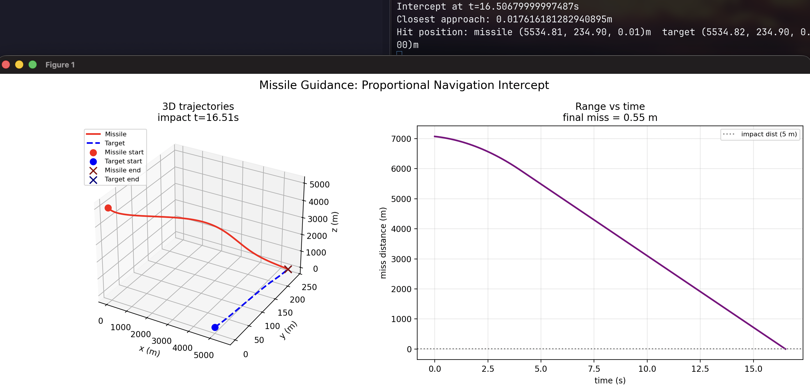

# Missile Guidance Simulation

A 3D missile guidance simulation written in Rust. A homing missile intercepts a maneuvering (weaving) target using **augmented proportional navigation (APN)** with classic 4th-order Runge-Kutta (RK4) integration.

## How it works

- `src/vec3.rs` — minimal 3D vector math (`dot`, `cross`, `norm`, operators).
- `src/guidance.rs` — guidance laws:
  - `proportional_navigation` — classic PN: `a = N · Vc · (Ω × û_m)`.
  - `augmented_proportional_navigation` — APN, adds target-acceleration compensation `(N/2) · a_t⊥`, enabling intercept of maneuvering targets.
- `src/main.rs` — simulation loop (RK4 at `dt = 1e-4` s), boost phase, lateral-acceleration limit (20 g), closest-approach tracking, and CSV output.
- `visualize.py` — plots missile/target 3D trajectories and range-vs-time.

## Running

```sh
./run.sh
```

or step by step:

```sh
cargo run --release   # prints intercept results, writes trajectory.csv
python3 visualize.py  # opens matplotlib plots
```

### Requirements

- Rust toolchain (stable)
- Python 3 with `numpy` and `matplotlib`

## Default scenario

| Parameter | Value |
|---|---|
| Missile start | (0, 0, 5000) m |
| Target start | (5000, 0, 0) m, ~33.6 m/s |
| Target maneuver | 3 m/s² lateral weave @ 0.5 Hz |
| Boost | 100 m/s² for 4 s |
| Max lateral accel | 196.2 m/s² (20 g) |
| Navigation gain N | 4.5 |
| Impact distance | 5 m |

Expected result: intercept at ~16.5 s with < 0.1 m miss distance.

## Modify scenario

You can modify the senario by changing impl Default value's for missile and target stats and te main function state variable for missile and target positions

## Demonstration screenshot


## License

[MIT](LICENSE)
